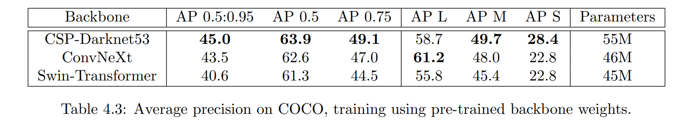
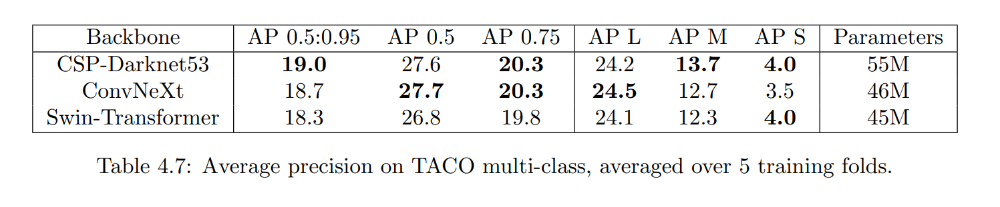
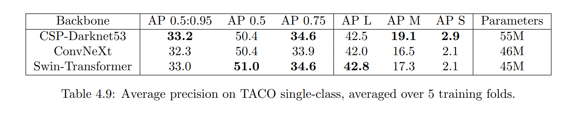

# <ins>SwinTD (Swin-Transformer Trash-detect)</ins>

Completed for my MEng final project. I explore the performance of vision transformers (specifically Swin-Transformers https://arxiv.org/abs/2103.14030) against CNNs, for the task of rubbish detection with the TACO dataset (http://tacodataset.org/). The tested models have a YOLOX head (https://arxiv.org/abs/2107.08430) and PAFPN (https://arxiv.org/abs/1803.01534v4) and differing backbones.

## <ins>COCO training results with pre-instantiated and frozen backbone weights:</ins>

## <ins>TACO-10 training results:</ins>

## <ins>TACO-1 training results:</ins>

